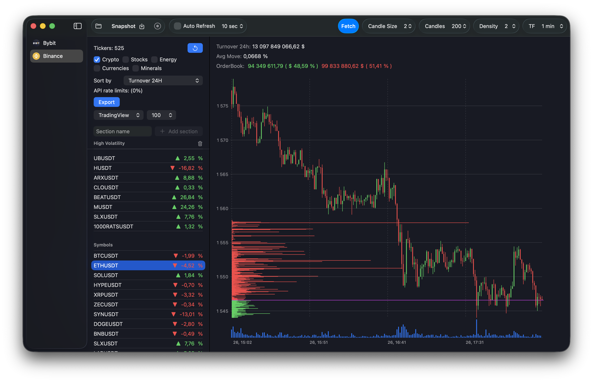
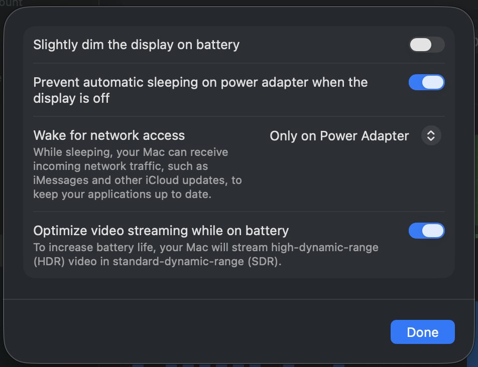
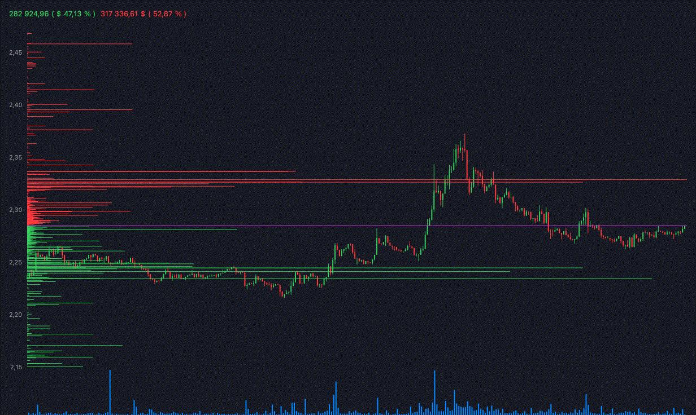

# Order Book Chart

The application draws the candlestick chart (like TradingView) and Order Book on top of it. Why? Because you cannot use realtime data from CEX to build Order Book indicator on top of the chart on TradingView.



## Technologies

- Xcode 26.2
- Swift 6.2
- SwiftUI
- Swift Charts

## Data providers

The app uses klines, orderbook and rpi_orderbook API from

- Binance
- Bybit

# What you can do with it

## Live chart

- See the live chart as TradingView does with realtime order book data.
- Sort symbols
- Export symbols to the TradingView format

## Take a snapshot

Take a snapshot of the current chart. It will be stored in an app directory, use `Folder` button to open it.

# Installation

## From Release section

- Download latest release
- Unzip the release archive
- Move `OrderbookChart.app` to */Applications/* folder
- Launch `OrderbookChart.app` application
- If the app cannot be launched because of the signature of an untrusted developer, then do the next step
- Allow the system to run the application from a not trusted developer

```bash
xattr -d com.apple.quarantine OrderbookChart.app
```

## Build from sources (Xcode 26.1+)

- Download this repository
- Open `Terminal.app`
- Go to the repository sources in `Terminal.app`

```bash
cd ~/Downloads/OrderbookChart/
```

- Build the project by running the commands below in `Terminal.app`

```bash
./make_release.sh
```

- Find `OrderbookChart.app.${arch}.zip` under the hidden folder ./.build
- Unzip the built archive
- Move the app to */Applications/* directory.
- Launch `OrderbookChart.app` application

## Record live chart

### Prepare macOS do not sleep when the screen is off



App needs this because it actually does not record real video, it just stores snapshots of the chart in the loop with a given time interval to not use too much CPU of your MacBook. After that you have to make a video from snapshots. How to do it is described below.

### How to start recording

1. Select a CEX and USDT pair.
2. In the application set settings for the chart timeframe, candles, orderbook density.
3. In the application set setting for a refresh interval.
4. In the application use `Record` button to start record.
5. Leave the application running for several hours (depends on the timeframe you have selected).
6. To stop, use the same button.
7. See the result snapshots use `Folder` button. 
8. Use `ffmpeg` cli tool to convert snapshots to video.

## ffmpeg

- Prepare `images.txt` file with

```bash
cd /Users/${USER}/Library/Containers/OrderboolChart/Data/tmp/${TOKEN}USDT
# Each image will be shown for 0.5 seconds.
# Then refresh rate is 2 images per second.
# Less images per second more details changes will be visible.
# Be sure that files order is by ascending creation date (from oldest to newest).
for f in *.png; do echo "file '$f'" >> images.txt; echo "duration 0.5" >> images.txt; done
```

- Run to convert a series of images listed in the file to video
```bash
ffmpeg -f concat -safe 0 -i ./images.txt -c:v libx264 -crf 10 -pix_fmt yuv420p ./output.mp4
```

